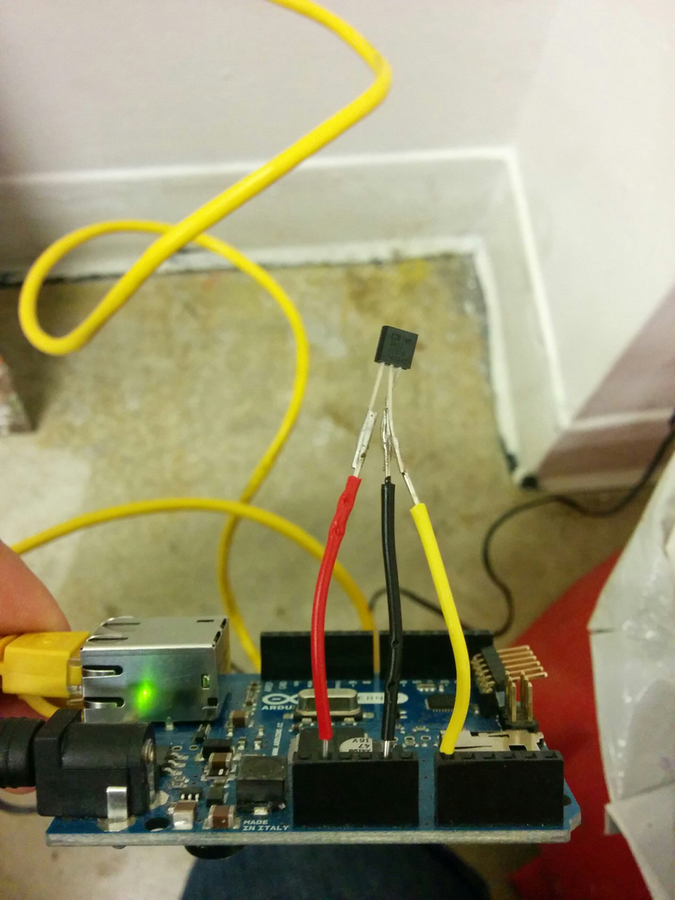
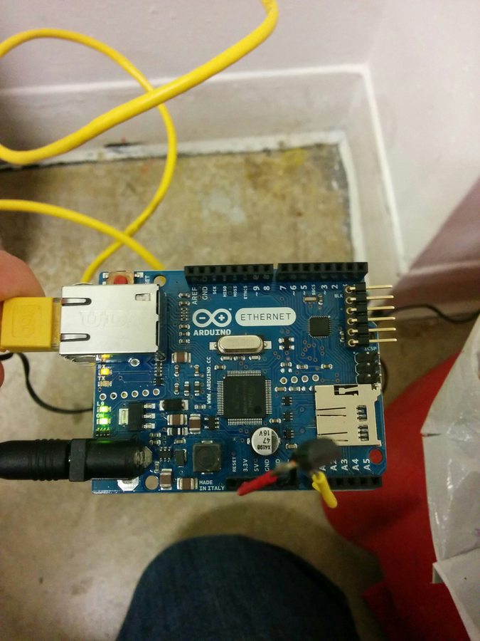

## What temp is my studio?
### An Arduino + Dashing.io project

The problem: To know what temperature the studio was considering it could radically change from day-to-day and affect
the ability of the person working in there.

The solution: Use the ethernet connection from within the studio to connect an Arduino and send the temperature data
over the internet to a dashboard application to be able to display the temperature on a mobile-responsive screen.

#### Dashing.io Usage

Using [Dashing.io](http://shopify.github.com/dashing) to quickly generate a mobile-friendly dashboard, I was able to
to make the Arduino POST to a Heroku web address that my dashing.io application was running on.

The `config.ru` was modified to include an environment variable. This will have to be set-up on the Heroku application
and for local development, be included in a `.env` file.

```
API_KEY=XXXXXXXXXXXXXXXXXXX
```

#### Arduino Usage

The Arduino is using 3 ports (3.3v, GND, A0) to power the [temperature sensor](https://www.adafruit.com/products/165).
You will also notice that this is not any Arduino but an [Arduino Ethernet](https://www.arduino.cc/en/Main/ArduinoBoardEthernet). An
Ethernet-shield Arduino will work as well. The reason for going Ethernet instead of using Wi-Fi was to gurantee access and not have 
to worry about Wi-Fi password and login restrictions.




The arduino code is included within this repo as *temperature_sensor_client.ino*. All of the credentials and host
information will have to be provided within the code itself to run successfully.

#### Special Thanks

Special thanks to [frankiethekneeman](https://github.com/frankiethekneeman) for figuring out how to write the crazy
POST request from the Arduino to the dashing.io application.
